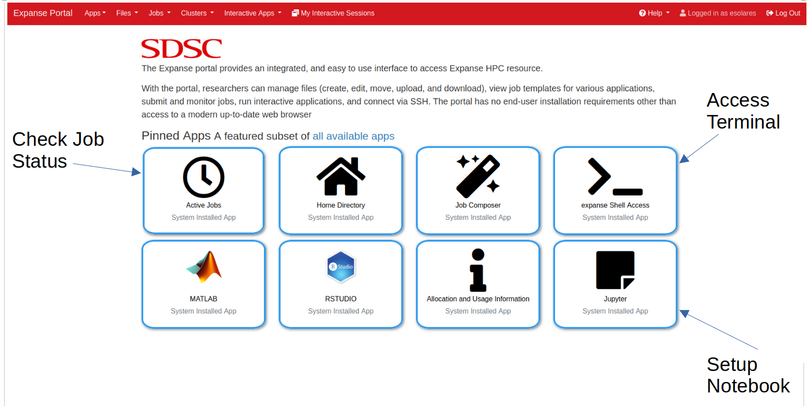

# Group Project Information

## Login to SDSC Expanse
Go to `portal.expanse.sdsc.edu` and login with your "access-ci.org" or "ucsd.edu" credentials.

## Portal Navigation
Once you are logged in, you will see the following SDSC Expanse Portal, along with several Pinned Apps. 


We will be working with the following apps:
1. **Active Jobs**: To check jobs' status.
2. **expanse Shell Acess**: To access Terminal.
3. **Jupyter**: To setup Jupyter notebook and run JupyterLab.

## First Time Login
Click on the "expanse Shell Access" app. Once you are in terminal, please the following commands: 
```bash
# Create a new folder with your username 
# and add symbolic link
ln -sf /expanse/lustre/projects/uci150/$USER

# Add symbolic link to `esolares` folder where 
# the singularity images are stored
ln -sf /expanse/lustre/projects/uci150/esolares

# (Optional)
# To see your group members folders, do the following
# for each group member's usernames
ln -sf /expanse/lustre/projects/uci150/GROUPMEMBERUSERNAME
```

## Support
If you are having trouble, please submit a ticket to https://support.access-ci.org/.
