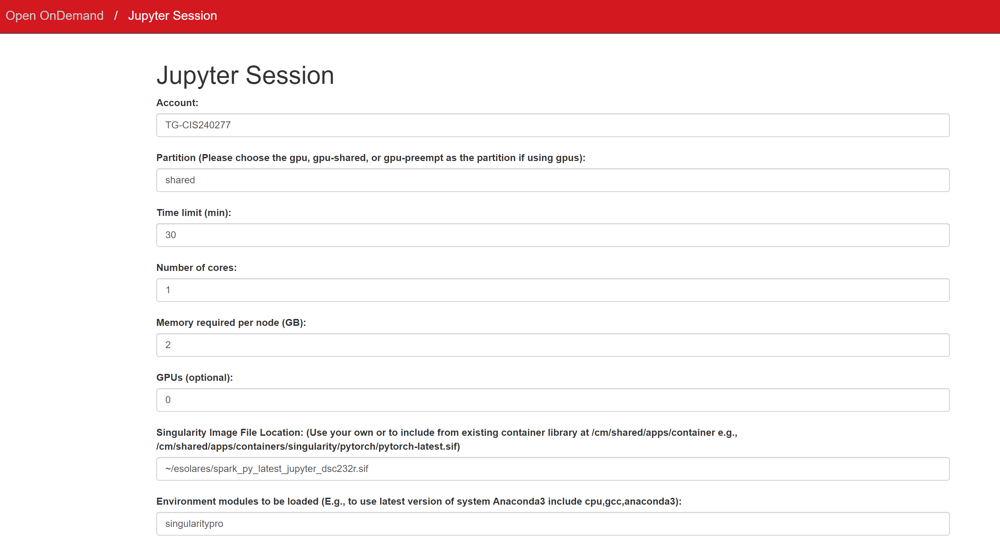
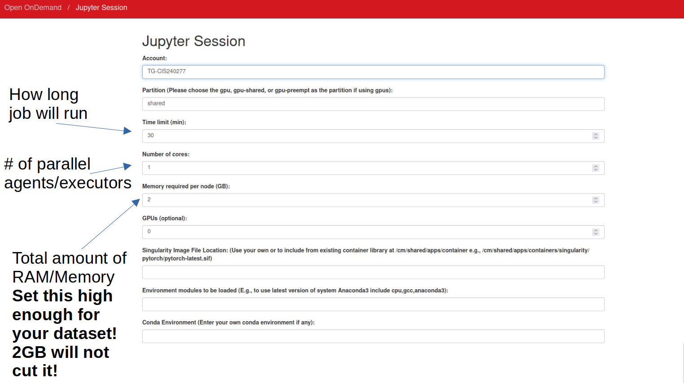

# Group Project Information

## Login to SDSC Expanse
Go to `portal.expanse.sdsc.edu` and login with your "access-ci.org" or "ucsd.edu" credentials.

## Portal Navigation
Once you are logged in, you will see the following SDSC Expanse Portal, along with several Pinned Apps. 


We will be working with the following apps:
1. **Active Jobs**: To check jobs' status.
2. **expanse Shell Acess**: To access Terminal.
3. **Jupyter**: To setup Jupyter notebook and run JupyterLab.

## First Time Login
Click on the "expanse Shell Access" app. Once you are in terminal, please the following commands: 
```bash
# Create a new folder with your username and add symbolic link
ln -sf /expanse/lustre/projects/uci150/$USER

# Add symbolic link to `esolares` folder where the singularity
# images are stored
ln -sf /expanse/lustre/projects/uci150/esolares

# (Optional)
# To see your group members folders, do the following for each 
# group member's usernames
ln -sf /expanse/lustre/projects/uci150/GROUPMEMBERUSERNAME
```
>Note that you need to run the above instructions only once when accessing the Portal for the first time. 

## Jupyter
Click on the "Jupyter" app. It will allow you to request a new Jupyter Session as shown below:



You will need to fill out the following fields: 
- **Account**: `TG-CIS240277`

- **Partition**: `shared`

- **Time limit (min)**: Enter an integer value denoting the number of minutes you want to work on your notebook environment.

- **Number of cores**: Enter an integer value denoting the number of cores your pyspark session with need. Enter a value between 2 and 8.

- **Memory required per node (GB)**: Enter an integer value denoting the memory required per executor (worker nodes). Please keep this at 2GB. You may increase it if you get issues where you need more than 2GB per executor in your Spark Session (Spark will let you know about the amount of RAM being too low when loading your datasets).

- **Singularity Image File Location**: `~/esolares/spark_py_latest_jupyter_dsc232r.sif`

- **Environment Modules to be loaded**: `singularitypro`

- **Working Directory**: `home`

- **Type**: `JupyterLab`

Once you have filled out the above fields, go ahead and click "Submit".




## Support
If you are having trouble, please submit a ticket to https://support.access-ci.org/.
